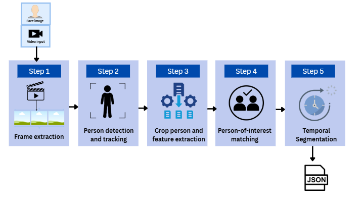
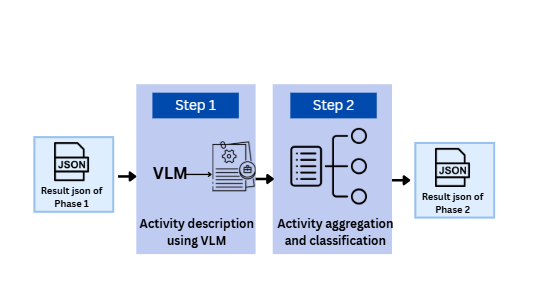

# Visual Intelligence: VLM-Based Person Behavior Analysis and Classification

**UCLA MEng Capstone × Securiport**

Facial recognition is already part of the airport environment — TSA's CAT-2
system, for example, compares a live traveler image against their ID photo.
That confirms identity at a single moment. **Visual Intelligence** extends
that snapshot into video: given one reference photo and supplied footage,
it finds where the person appears, tracks how they move through a scene,
and summarizes what they're visibly doing — turning identity at one moment
into presence, movement, and activity across time.

## Problem statement

Given a reference photo and videos, answer three questions:

- **Find** — is the person present?
- **Describe** — what are they doing?
- **Assess** — is that activity positive, neutral, or negative?

The goal is to support security personnel by organizing relevant visual
evidence — not to make the security decision itself. A human analyst
reviews the flagged footage and makes the consequential call.

Team: Harsh Dadhich, Kuo Peng Huang, Samhith Kakarla, Janani Venkatramani,
Marvin Wong.

**[▶ Live Demo — three-case pipeline trace](https://vlm-result-demo.netlify.app/)**
An interactive, step-by-step trace of the full pipeline on three example
cases — detection/tracking, per-track identity scoring against the
reference headshot, quality-gate rejections, the exact evidence frames sent
to the VLM, and the final Phase 2 result:
- *Guitar performer* → **neutral** (0.95 confidence)
- *Car break-in* → **negative** (0.98 confidence)
- *Helping a fallen pedestrian* → **positive** (0.95 confidence)

## Why this is hard

A checkpoint controls the reference photo; surveillance video does not.

- **Capture** — low resolution, blur, side views, occlusion
- **Scale** — one video, thousands of comparisons
- **Cost** — a false match points at the wrong person

Bottom line: the system has to be able to confidently say the person is
**not** there, not just find matches when they are.

## What already exists (and the gap we address)

Good components exist, but none of them does the whole job:

| Category | Strength | Gap |
| --- | --- | --- |
| Cloud services (Rekognition, Azure Video Indexer) | Scaling, storage, auth handled | No access to embeddings or model version |
| Face libraries (InsightFace, DeepFace) | Local embeddings, quick to test | No video ingest, tracking, or thresholds |
| Detection/tracking (YOLO, BoT-SORT, ByteTrack) | Finds people, keeps them across frames | Doesn't decide *who* they are |

We built the pipeline out of these parts, and specifically addressed four
gaps in prior work: accuracy is usually reported only on clear, closed-set
images (we evaluate frame-level *and* track-level at a stated threshold);
detection/tracking/recognition are usually measured separately (we
evaluate Phase 1 alone, then Phases 1+2 together); identity and behavior
are usually studied apart (we tie the matched identity directly to the
behavior description); and evidence is usually treated as a logging
artifact rather than an output (we keep evidence frames and timestamps for
every result).

## Architecture

**Implemented:** Phases 1 + 2.
**Future:** Phase 3 — automated retrieval of candidate videos from various
sources (e.g. social media), to broaden the search beyond footage handed
directly to the system.

### Phase 1 — Person Recognition and Tracking

Five sequential steps convert a query image and raw video into
time-stamped evidence for one person:

1. **Frame extraction** — FFmpeg, 4 fps
2. **Person detection and tracking** — YOLOv8n for detection, BoT-SORT for
   tracking across frames
3. **Crop person and feature extraction** — ArcFace embedder
4. **Person-of-interest matching** — cosine similarity against the
   reference embedding; multiple observations strengthen the identity
   decision
5. **Temporal segmentation** — observations grouped into appearance
   windows, with a new window starting after a 1.5s gap

**Output:** a per-target JSON with track ID, timestamps, bounding boxes,
and evidence frame paths, passed to Phase 2.

### Phase 2 — VLM-Based Person Activity Description and Classification

Runs only if Phase 1 produced evidence frames for the target.

- **Model:** Qwen3-VL-4B-Instruct
- **Max tokens:** 512
- **Attention:** SDPA

Step 1 generates an activity description from the evidence frames via the
VLM; Step 2 aggregates those observations into an overall behavior
classification (positive / neutral / negative) plus a summarized
description.

## Evaluation setup

Two evaluation tracks: identity matching alone, then the full pipeline
together.

- **FaceSurv dataset (Phase 1):** 252 subjects, 460 videos, 142,000+ face
  images, post-processed to 228 enrolled subjects, 720 probe tracks, and
  6,174 embedded face crops across day and night conditions.
- **Phases 1+2 combined:** 32 evaluation data points — 20 manually
  annotated MEVID videos (18 identities) plus a 12-video AI-generated
  synthetic set spanning positive, negative, and neutral behavior. 28 of
  32 cases include the target and enter Phase 2 evaluation; the class
  distribution (~69% neutral) is deliberately weighted toward realistic,
  low-signal screening conditions rather than staged incidents.

## Results

### Phase 1 — Identification & Verification

| Metric | Result |
| --- | --- |
| Frame-level Top-1 | **91.94%** (5,955 probe items) |
| Track-level Top-1 | **98.40%** (688 probe tracks) |
| Verification ROC-AUC | **0.9856** |
| Equal Error Rate (EER) | **4.70%** |

Track beats frame: aggregating multiple observations before making an
identity decision offsets pose, blur, and occlusion in any single frame.

### Phase 2 — Classification & Description

| Metric | Result |
| --- | --- |
| Classification accuracy | **96.43%** (27 of 28 correct) |
| Description accuracy (human-evaluated) | **85.71%** (24 of 28 correct) |
| Misclassifications | 1 of 28 — a negative shoplifting case read as neutral |

The one miss: the generated description omitted the moment the target
left without paying, so the aggregate score read as neutral. Human-rated
description accuracy trails classification accuracy, showing that
generating a *complete* natural-language description is harder than
assigning a broad sentiment label.

### Failure modes

- **Incomplete description** — the VLM missed a subject leaving a store
  without paying.
- **Wrong target** — the VLM described the person *behind* the tracked
  subject instead of the subject itself, when multiple people shared the
  frame.
- **Key trade-off** — the 0.4 cosine-similarity identity threshold reduces
  false matches but is overly restrictive: it cuts frame-level Top-1
  accuracy from 91.94% to 67.30%. This threshold needs tuning and
  revalidation on representative open-set conditions before deployment.

## Key discoveries

Four decisions that actually moved accuracy, each driven by an evaluation
finding rather than a guess:

- **Purpose-built beats general-purpose (Phase 1).** Started with more
  general encoders (DINOv2, dlib); switching to ArcFace — built
  specifically for facial recognition — was the single biggest
  architectural win in Phase 1.
- **Thresholding needs calibration, not defaults (Phase 1).** A 0.4
  similarity cutoff looked conservative but rejected genuine matches
  constantly, especially on low-resolution video. The underlying matching
  was actually strong — a 90.85% true-accept rate at a 1% false-accept
  rate showed the threshold, not the embedder, was the problem. Further
  tuning on production-representative video is still needed.
- **More frames help, but only if gated for quality (Phase 1).** Naively
  averaging similarity across a whole tracked appearance is risky, since
  tracking isn't perfect and can pick up identity switches or bad frames.
  The pipeline instead uses quality-gated, top-K consensus scoring, which
  needs multiple reliable observations to agree before trusting a match.
- **Grounding the VLM helps, but isn't free (Phase 2).** Boxing the
  target in each frame and restricting the model to describe only visible
  evidence kept output on-target most of the time, but wasn't foolproof —
  errors still occurred when multiple people shared a frame, or when the
  relevant incident happened outside the camera's field of view.

## Design principles

- **Privacy** — only the target person is analyzed; others in frame
  remain undisturbed.
- **Evidence-based analysis** — every classification is linked to a
  specific sequence of evidence frames.

## Limitations

All results above come from curated benchmarks; the pipeline has not yet
been tested end-to-end on real, open-web video, and all parameters are
tuned against these same datasets.

- Phase 1 evaluated on a single benchmark (FaceSurv): frontal,
  single-subject footage.
- Phase 2 evaluated on a small (28-item), internally validated set — not
  externally reviewed.
- No formal fairness or demographic bias audit has been conducted.
- The identity threshold was separately tuned to 0.15 but still needs
  open-set validation before deployment.

## Recommended next steps

- **Implement Phase 3** — automated, web-scale candidate video discovery.
  This is the biggest open dependency: Phases 1+2 currently only process
  video handed to them directly, while the project's actual goal —
  identifying someone from a reference photo across open-web sources —
  depends on a phase that doesn't exist yet.
- Expand and independently validate both evaluation sets.
- Run a formal fairness audit and legal/compliance review before any
  deployment.
- Pilot with human analysts reviewing every flagged case.
